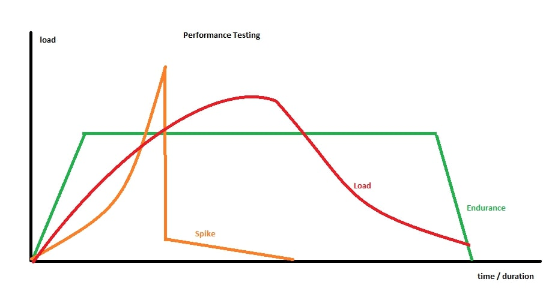

# Test flake

<br/><br/>

### One Paragraph Explainer

Tests must produce consistent results every time. Repeatable pipeline execution results are the quorum.
If a test cannot produce reliable results, it reduces confidence in the tests and requires maintenance which reduces all value. In these cases, it may be best to manually test the functionality.

And ask yourself these questions:

* How do you address Test Flake and ensure test-confidence through growing pains?
* How do you address false-negatives with the pipeline, infrastructure, shared resources and not having control?
* How do you reveal **Sporadic Defects**?

<br/><br/>


### Step 1: Locally identifying test flake

Headless execution in an OS that replicates pipeline CI machine is preferred; Linux and MacOS will behave more similarly to the pipeline than Windows -with the exception of Windows Docker containers if you are using one. Headless execution will reveal more of the test flake. There are various ways to repeatedly execute a test spec, one example from Cypress is using the Lodash library (already built-in with Cypress) `Cypress._.times( <times to repeat>, () => { <your test spec code> })`. This must be utilized before pushing any code for a merge request.

#### Code Example

```JavaScript
// will repeat the full suite 10 times
Cypress._.times( 10, function {

  describe('..', function () {

    before(function () {
    });

    beforeEach(function () {
    });

      // you can place it anywhere to repeat 1 test, or another describe / context block
      Cypress._.times( 3, function {
        it('..', function () {..});
      }
      it('..', function () {..});
      it('..', function () {..});
      it('..', function () {..});

  });
});

// this will result in 6 tests per run x 10 runs = 60 executions

```
<br/>

### Step 2: Identifying test flake in the pipeline & retries

After initial pipelines pass, things are looking good and the code gets merged, it just so may happen that tests ***sometimes*** fail in the pipeline.

Why do tests still fail if ***there are no reproducible defects*** and ***the test code has been fully optimized***?

Rather than the tests failing at a sporadic rate, getting ignored, or worse ***reducing the team's confidence in them***, retry mechanisms can be utilized:
* To work around an unreliable pipeline infrastructure that the team has no control over
* Growing pains during development and / or dependencies on external services under development
* Most importantly ***to lock-in on sporadic system issues***


#### Code Example

Many frameworks implement retry utilities. Here is an example from Cypress' [cypress-plugin-retries](https://github.com/Bkucera/cypress-plugin-retries):

```javascript
// retry only the test
it('should get a response 200 when it sends a request', function () {
  // mind the function scope and use of 'this'
  this.retries(2);
  cy...( … );
});

// retry a full spec
describe('top level describe block', () => {
  // can use lexical scope with this one
  Cypress.env('RETRIES', 2);

  before( () => { // or beforeEach
    // these do not get repeated
  });

  // your tests...
});
```
### Step 3: Identifying sporadic system issues - *system flake*

Given that:

* There are no reproducible defects
* The test code is fully optimized
* Pipeline issues are known and validly worked-around with test retries
* External dependencies, growing pains are known, recognized and worked around with test retries

... How do we detect deeper issues with the system that *may* indicate *system-flake*? Here is a snapshot from a team's [Cypress dashboard](https://www.cypress.io/dashboard/) of such an example:

 >*"It fails at 10% rate over 40 executions on the weekend... We ran the test suite 40 times, and in one of them saw the spec retrying 2 times until it passed..."*


*Pleas note: the camera icon means that there are some test failures because Cypress takes videos and screenshot on failures.*


In these cases, consistency testing with [cron jobs](https://crontab.guru/#0_1-23_*_*_6-7) overnights or the weekends can be utilized as the initial indicator of deeper system issues. These are usually the ambiguous defects that are likely to leak into production, be found on the field and have costly repercussions at a larger scale.


#### Code Example - [cron jobs](https://crontab.guru/#0_1-23_*_*_6-7)

```cron syntax
at minute 0 at midnight and 2 am, every day-of-week from Monday through Friday:

0 0,2 * * 1-5


At minute 0 past hour 2, 6, 8, 10, 12, 14, 16, 18, and 20 on every day-of-week from Saturday through Sunday:

0 2,6,8,10,12,14,16,18,20 * * 6-7
```

Once all other factors are ruled out and the initial indication of *system-flake* realized in automated tests in the pipeline with cron jobs, these issues are perfect candidates for **Performance Testing** because such test methodology can directly indicate shortcomings in the system that may be causing the *system-flake*.

Here is performance testing in a nutshell:




There are many performance testing tools. One that we find approachable due to it being in ES6 and pipeline friendly is [k6-loadImpact](https://docs.k6.io/docs). A simple tutorial with code samples can be found [here](https://github.com/muratkeremozcan/k6-loadImpact).

### References
[Google Testing Blog: Where do our flaky tests come from](https://testing.googleblog.com/2017/04/where-do-our-flaky-tests-come-from.html)
